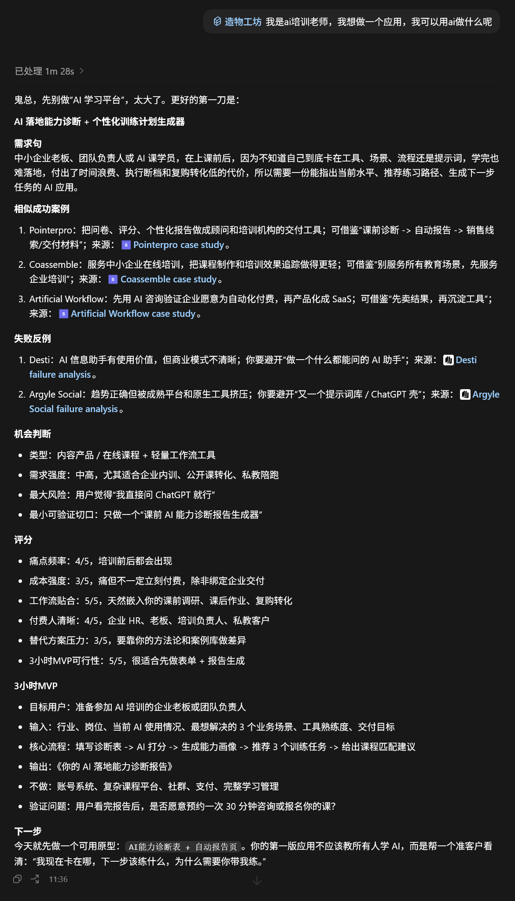

<div align="center">

# maker-forge · 造物工坊

> *「把模糊想法锻造成可验证的 3 小时 MVP」*

<br>

**会提供一些产品案例，帮你判断真需求、找到相似路径、避开失败陷阱，并把想法收束成一个今天就能动手的原型。**

不是给你一堆案例让你自己翻。<br>
是你说出一个想法，我帮你找相似成功案例、失败反例、需求句、最小切口和验证动作。

<br>

[效果示例](#效果示例) · [装上就能用](#装上就能用) · [能做什么](#能做什么) · [怎么做的](#怎么做的) · [局限](#局限) · [License](#license-与二次创作)

</div>

---

## 效果示例

一个用户说：「我想做一个给培训老师用的 AI 工具，但不知道是不是真需求。」



这时用户不是只拿到一句「可以做」，而是拿到一个可以马上验证的切口：找 3 个培训老师，把他们的一段真实课程材料丢进去，看他们愿不愿意用、愿不愿意改、愿不愿意付费。

---

## 装上就能用

打开你正在用的 AI agent，告诉它：

```
帮我安装这个 skill：https://github.com/ghostyee2023/maker-forge
```

或者用通用 CLI 安装器：

```bash
npx skills add ghostyee2023/maker-forge
```

装好后直接说话：

```
帮我判断这个产品想法是不是真需求：我想做一个给本地商家用的客户回访工具
把这个想法锻造成 3 小时 MVP：给培训老师生成练习题和复盘报告
帮我找几个相似成功案例和失败反例
把这个产品想法改成一组用户访谈问题
```

如果自动加载失败，手动把 `SKILL.md` 的内容粘贴进对话也能用——它本质就是一份 markdown + YAML frontmatter。

---

## 能做什么

造物工坊当前是轻量版，核心能力是把一个模糊产品想法变成可验证的 MVP。

| 能力 | 说明 | 产出 |
| --- | --- | --- |
| **需求句锻造** | 把一句模糊想法改写成清晰需求 | 谁、在什么场景、因为什么问题、付出什么代价、需要什么结果 |
| **成功案例类比** | 从案例库里找相似路径 | 3-5 个相似成功案例，附来源链接 |
| **失败反例预警** | 找出类似失败模式 | 2-3 个失败反例，提醒竞争、商业模式、体验、平台依赖等风险 |
| **机会评分** | 判断需求强度和可做性 | 痛点频率、成本强度、工作流贴合、付费人清晰、替代方案压力、MVP 可行性 |
| **3 小时 MVP** | 把想法收束成当天可做的最小版本 | 目标用户、输入、流程、输出、不做什么、验证问题 |
| **训练题生成** | 把案例改造成产品判断练习 | 隐藏结果、提问、揭晓、复盘启发 |

---

## 怎么做的

造物工坊不是预测未来，它做的是「案例类比 + 风险反查 + 最小验证」。

**先锻造需求句**  
把想法从「我想做个工具」变成：

```text
谁，在什么场景下，因为现有方案什么问题，付出了什么代价，所以需要什么结果。
```

**再找相似案例**  
不是只搜行业词，而是搜工作流：培训、销售、表单、报价、提醒、复盘、报告、支付、审批、客户跟进、内容生产。

**然后找失败反例**  
每个想法都要反查：是不是已有巨头顺手能做？是不是交付成本太重？是不是用户嘴上喜欢但不愿意付费？是不是平台依赖太强？

**最后压成 MVP**  
不做完整平台，不做宏大愿景。只问今天 3 小时能做出什么，让一个真实用户愿意试一下。

---

## 适合谁

- **产品创作者**：判断一个想法是不是值得做。
- **独立开发者**：从模糊需求收束到可开发原型。
- **课程和训练营设计者**：把案例变成产品判断练习。
- **咨询和交付团队**：给客户做机会诊断和 MVP 路线建议。
- **内容创作者**：把案例拆成选题、文章、方法论和训练题。

如果你只是想要一个通用商业灵感清单，造物工坊可能过重。它最适合已经有一个想法，想判断「下一步怎么做」的人。

---

## 局限

诚实地说：

- **案例不是证明**：相似案例只能提供类比、问题和风险，不能证明你的客户一定买单。
- **来源数据未二次审计**：收入、团队、融资等信息来自原案例资料，应作为参考，不当作审计事实。
- **检索仍是轻量版**：当前脚本以关键词和中文片段匹配为主，复杂语义需要 AI 再判断。
- **容易过度类比**：看到相似成功案例会让人兴奋，但失败反例和真实访谈更重要。
- **仍是早期版本**：建议先用真实产品想法跑几轮，再决定是否升级检索和评分方式。

一个好用的造物工具，不该替你冲动。它应该帮你更快地动手，也更早地刹车。

---

## 验证状态

当前版本：`v0.1.0`。

已验证：

- skill 基础格式通过 `quick_validate.py`。
- 脚本可解析案例库。
- 检索结果可输出成功案例、失败反例和来源链接。
- 已移除原始采集元数据和私有工作区路径。

待验证：

- 真实产品想法至少 3 轮试跑。
- 检索质量是否稳定命中语义相似案例。
- 3 小时 MVP 建议是否足够可执行。
- 是否需要升级为结构化 JSON 案例库和混合检索。

---

## License 与二次创作

本项目采用 MIT License，详见 `LICENSE` 文件。

你可以在 MIT License 允许范围内使用、复制、修改、合并、发布和分发本项目，但需要遵守以下约定：

- 保留原作者署名和 License 声明。
- 如果基于本项目进行衍生创作，请在 README 或作品说明中注明"基于 maker-forge"。
- 如果对项目做了较大改造，建议使用新的作品名称，避免让用户误以为是原项目官方版本。
- 不要删除原始 License，也不要把本项目包装成未经授权的他人原创作品。

如果你不确定自己的二次创作是否合规，建议先在作品说明中写清楚来源、修改范围和授权方式。
